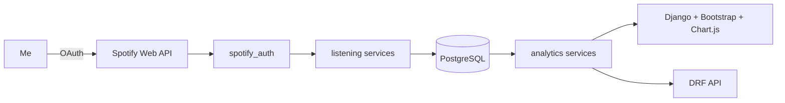

<div align="center">

# SoundScope 🎧

### I got curious about my Spotify habits, so I built my own Wrapped.

[](https://www.djangoproject.com/)
[](https://www.postgresql.org/)
[](https://developer.spotify.com/documentation/web-api)
[](#checks)

My listening history, top artists, repeat obsessions, questionable 2 AM music
choices, and yearly recap — all in one private dashboard.

</div>

---

## The vibe

Spotify shows me what I played. SoundScope shows me **how I listen**.

I connect my account through Spotify OAuth, periodically collect the listening
data Spotify exposes, store it in PostgreSQL, and turn it into a minimal,
image-first analytics dashboard. No React. No AI-generated personality lore.
Just Django doing Django things.

## What I built

- My Spotify profile, top tracks, top artists, saved tracks, and playlists
- Recently played history stored without duplicate playback events
- Monthly and yearly listening summaries
- Estimated listening time, streaks, peak hours, weekend habits, and replay stats
- A deterministic listening personality such as `Night Listener`
- Full-screen, shareable Wrapped stories with revocable public links
- Artist portraits and album artwork pulled from Spotify
- Session-authenticated REST endpoints with strict user isolation
- Sync commands that work manually, through cron, or later through Celery
- Docker Compose with Django + PostgreSQL

## Under the hood



```text
spotify_auth  → OAuth, token refresh, Spotify API client
listening     → artists, albums, tracks, plays, playlists, sync commands
analytics     → statistics, personalities, public Wrapped snapshots
dashboard     → server-rendered pages and charts
```

The Spotify client handles timeouts, expiring tokens, one bounded `401` retry,
and `Retry-After` for rate limits. Tokens stay server-side and never appear in
the API or admin.

## Run it locally

```bash
python -m venv .venv
source .venv/bin/activate
pip install -r requirements.txt
cp .env.example .env
```

For zero-setup local development, use SQLite in `.env`:

```env
DATABASE_URL=sqlite:///db.sqlite3
```

Then:

```bash
python manage.py migrate
python manage.py createsuperuser
python manage.py runserver
```

Open [127.0.0.1:8000](http://127.0.0.1:8000).

## Connect Spotify

1. Create an app in the [Spotify Developer Dashboard](https://developer.spotify.com/dashboard).
2. Add this **exact** redirect URI:

   ```text
   http://127.0.0.1:8000/spotify/callback/
   ```

3. Add the credentials to `.env`:

   ```env
   SPOTIFY_CLIENT_ID=...
   SPOTIFY_CLIENT_SECRET=...
   SPOTIFY_REDIRECT_URI=http://127.0.0.1:8000/spotify/callback/
   ```

4. Sign in to Django and hit **Connect my Spotify**.

The app requests only the scopes needed for profile, library, top-item,
recent-play, and playlist reads.

## Pull my data

One command syncs everything Spotify currently exposes:

```bash
python manage.py sync_all_spotify_data
```

Or I can run each collector separately:

```bash
python manage.py sync_spotify_profile
python manage.py sync_recently_played
python manage.py sync_top_tracks
python manage.py sync_top_artists
python manage.py sync_playlists
python manage.py sync_saved_tracks
```

Every command supports `--account-id ID`. Without it, connected accounts are
processed independently, so one failed account does not ruin the whole run.

## API, because obviously

```text
GET /api/profile/
GET /api/top-tracks/?time_range=medium_term
GET /api/top-artists/?time_range=long_term
GET /api/recently-played/?start=2026-01-01&end=2026-12-31
GET /api/playlists/
GET /api/saved-tracks/
GET /api/analytics/summary/
GET /api/analytics/monthly/?year=2026&month=7
GET /api/analytics/yearly/?year=2026
```

The history endpoint also accepts `artist`, `track`, and `playlist` filters.
All endpoints require an authenticated Django session and only return the
signed-in user's data.

## Docker mode

```bash
cp .env.example .env
docker compose up --build
docker compose exec web python manage.py createsuperuser
```

Compose swaps the database host to its internal `db` service, waits for
PostgreSQL to become healthy, applies migrations, and keeps the database in a
persistent volume.

## Checks

```bash
python manage.py test
python manage.py check
```

Spotify calls are mocked, so the suite needs no real credentials and does not
touch my account.

## The tiny reality check

Spotify's public API does **not** provide full lifetime playback history or the
official Wrapped calculations. The recently played endpoint exposes at most 50
items, so SoundScope builds detailed history from the moment collection starts.

Listening minutes are estimates based on stored playback events and track
duration; a playback event does not prove I finished the entire song. For older
history, I can import Spotify's Extended Streaming History export once it is
available.

## Production notes

Before putting this on the public internet I would:

- set `DEBUG=False`, a long random `SECRET_KEY`, and explicit `ALLOWED_HOSTS`
- enforce HTTPS and secure cookies
- store secrets outside the repository
- encrypt database storage and backups because OAuth tokens are sensitive
- serve static files through a reverse proxy or CDN
- run Gunicorn behind a load balancer
- schedule recent-play syncs frequently enough to avoid gaps

---

<div align="center">

Built for one extremely specific user: me.

</div>
